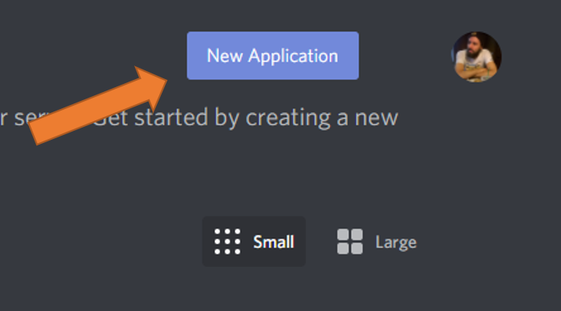
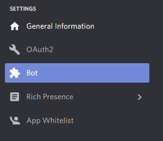
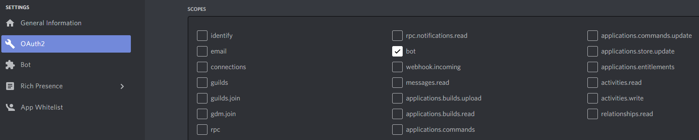

=============
Discord Setup
=============

The first step is to create a new server where you can invite and test the bot. To do that, login into your discord account
and inside the app follow this steps:

Create Discord Server
=====================
1. Click in the **Add a server** button on the left side panel.
2. Select **Create My Own**.
3. Choose either option, **For me and my friends** or **For a club or community**, it doesn't matter which one.
4. Input the **Server Name** and click on create.

Create Application
==================

Now that you have your own server you'll need to create the bot and invite it.

1. Navigate to the `application page <https://discord.com/developers/applications>`__
2. Click on the "New Application" button.

3. Name your application and click **Create**.
4. Go to the **Bot** tab and then click **Add Bot**. You will have to confirm by clicking "Yes, do it!".

5. Copy the bot's token and save it on the :ref:`credentials.yml <credentials_setup>` file.

Invite Bot
==========

The final step is to invite the bot to your server.

1. Go to the **OAuth2** tab and select **bot** under the **Scopes** section.

2. Choose the necessary permissions you want for the bot. See :ref:`Bot Permissions <bot_permissions>`.
3. After selecting the permissions, click the **copy** button above the permissions.
4. Paste the copied link on your browser, choose a server to invite the bot to, and click **Authorize**.
