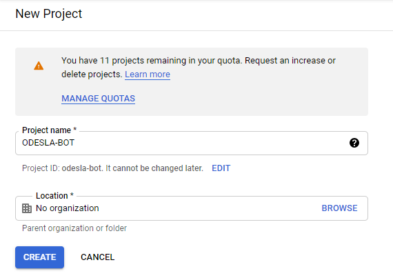
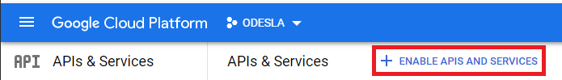
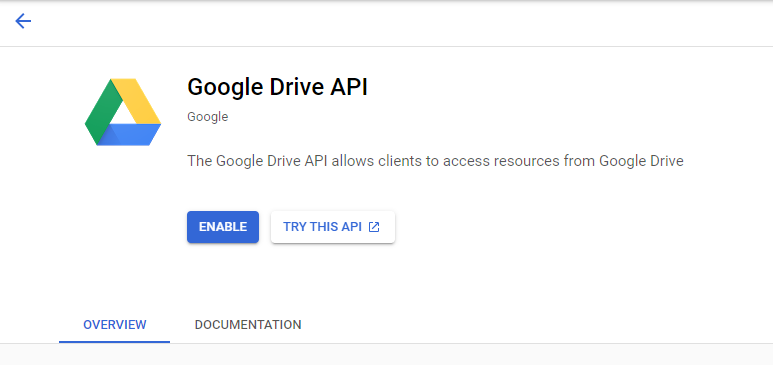
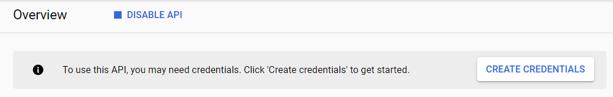
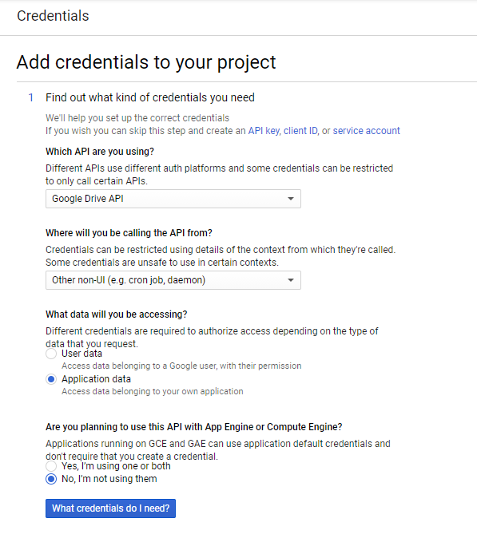
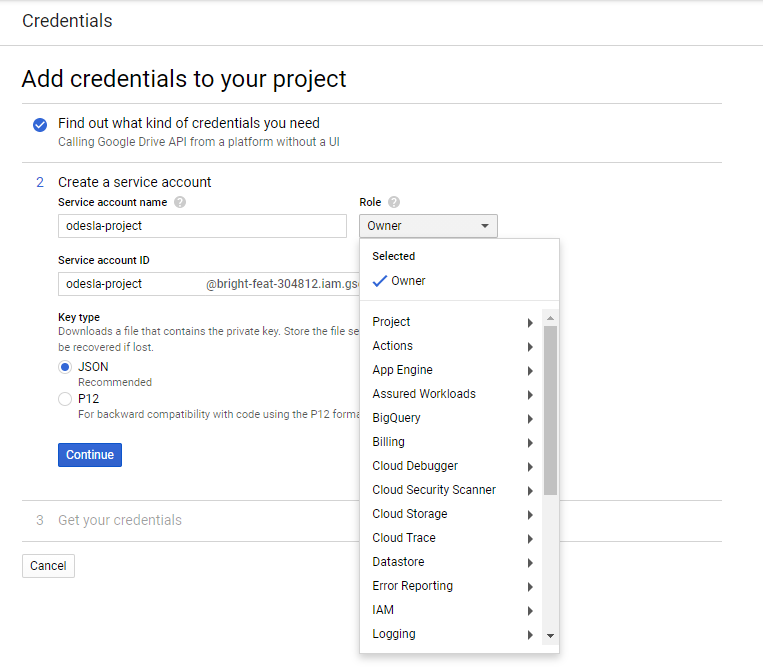

===========================
Google Cloud Platform Setup
===========================

In order to work with the google spreadsheets you will need to create and configure a Service Account; if you already have
a google account, you can follow these steps to create one.

1. Go to the `developer's console <https://console.developers.google.com/>`__ and click on the **Create Project** button.
2. Provide a name for you project and for your organization (optional). Then click on the create button.

3. Once the project is created we need to enable the APIs that we require in this project. Click on the **Enable APIs and
Service** button to search for the APIs that Google provides.

4. For our project you will need to enable the following APIs:
    * Google Drive API
    * Google Sheets API

Search in the search bar for these APIs and click on the enable button.

5. Now that the APIs are enabled we need to create the credentials for the service account. Click on the Create Credentials
button to continue.

6. Complete the form with the following parameters:
    a. Which API are you using? **Google Drive API**
    b. Where will you be calling the API from? **Other non-UI (e.g. cron job, daemon)**
    c. What data will you be accesing? **Application data**
    d. Are you planning to use this API with App Engine or Computer Engine? **No, I'm not using them**

Finally, click on the **What credentials do I need?** button

7. Fill a name for your Service account (e.g. odesla-bot) and select **Owner** as the Role. Choose **JSON** as the key
type and click on the Continue button.

8. Now a JSON file will be download which contains the keys to access the API. You'll need to move the different keys
inside that JSON file to the :ref:`credentials.yml <credentials_setup>` file.

9. Finally, if you want to access a spreadsheet through the API you will need to provide your service account edit access
for that sheet.
    a. Copy the **client_email** inside the JSON file.
    b. Click on the **Share** button inside your spreadsheet.
    c. Add the mail you copied from the JSON file and grant it **Editor** permissions.

